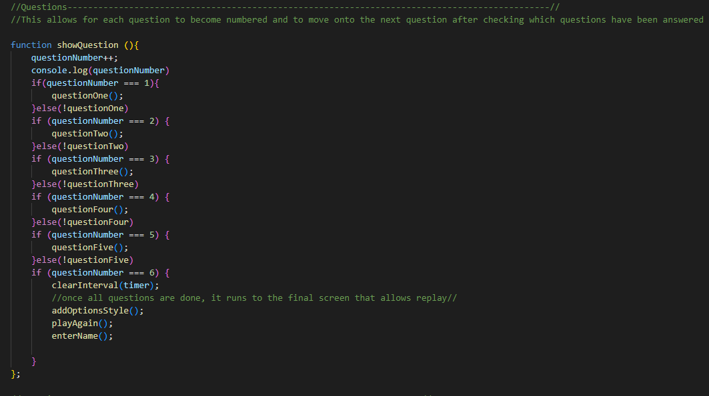

# 04 Web APIs: Code Quiz
## Deployed Page

https://nshaw973.github.io/Challenge-4-Code-Quiz/

## How To Use

1. Press Start
2. questions will begin to appear
3. if answered correctly, you'll be awarded 5 seconds, or else if answered incorrectly, 3 seconds will be deducted.
4. if all 5 questions are answered correctly, then you'll be able to enter your name and your score will be logged.
   if your time was up, then you'll be able to press the play again button and try again! 

## The Task

This weeks Challenge involved creating a code quiz that had 5 questions, a timer, and a scoring system that can be
inputed into a scoreboard that will then log into the local storage and allow the score to remain regardless if the page refreshes, or
the window is closed.  

## The Process

First thing I started off doing was getting the base items needed with my files organized.

Then I started to get the page stylized with basic header and footer, and then 2 content boxes that are going to hold the 2 most important components of the
application, the box on the left for the quiz, and the scoreboard on the right.

Once I got the page stylized it was time to get to coding.


With coding I saw multiple ways to start the application

I needed a:
Score System
Timer
The quiz with a way to move onto the next question

1st thing I started with was the timer:


First part of the function is pretty much just to get the timer going and start counting down from 10 as determined by the Var secondsLeft. the IF statement is just going to stop the timer once it reaches 0, or if it dips below 0 due to the nature of subtracting time. 

Once it reaches that 0, some functions to clean up the page begin t happen, and the button that was disabled to start the game will be re-enabled as well to allow taking the quiz again.
all these functions were added way later in the deveopment, this was just to get a timer started and to prevent it from dipping below 0 as well as make it interact with the start button.

2nd thing on the list was to add the questions with the functinality to get them to move to the next question.


For the questions, I just created the elements needed into the html. only thing that makes this function special is that once the function is invoked, it will add the text given to each variable.

below was adding event listeners for whenever the options were clicked and giving the correct answer event the correctAnswer function to allow it to add time, score, and move onto the next question.

if the user clicked on an option with the wrongAnswer function then time would be deducted.

There was a bug that was happening where the previous event listeners stayed after going to a new question. 
The problem was that once it went from question #2 to #3, the eventlistener with the correctAnswer function from #2 would stay and award points for the wrong answer in #3.
So what I did was add a remove event listener for all the options so that once a correct answer was given, the removeListeners function will happen and clear everything and then recreate the eventlistners made for the new question.

the questionReset function is added for precaution incase something broke and text started to pile on top of each other.

Adding the function showQuestions was a way to consolidate all the questions into a single function that would lead to the possible win screen.
This was in a way being setup as a way to randomize what question was going to appear neaxt, but I didn't want to get to side tracked into doing more than what was alredy needed.



What was a little important to this though was getting each question numbered so that way I can allow certain functions to invoke based on what question the user is on. It was mostly used for after all questions were finished to allow a seperate code to be a little easier to identify as oppose to stacking it all under the last question.


After the questions, score and timer had been set up, it was time to get the scoreboard setup to allow me to connect the three together and link them to the scoreboard which will log the scores to the local storage


Here is the code for the Scoreboard.


I had created some element variables that would be created by javascript that aren't in the HTML, with attributes being added afterwards as well. This would be what shows up with the input field for the name and where the final score is going to show up as well.

the first if statement is purely to prevent the user from pressing enter and leaving an empty name on the scoreboard, unless the user doesn't want to enter their score then they can just press play again and nothing will be logged.

the second if statement is to prevent the user from creating such a huge name that it would overflow past the page, and giving the player a warning not to do that.

Then it would push the final score onto the scoreboard list adding the name from the input field, and a dash to seperate the points the user had gained.
The empty string right after is to delete whatever was eneterd so that the input field didnt populate with whatever the user typed before.

Once those have gone through, the removeScoreBoard() function is there to remove all the elements javascript created, and the tiny green window thats a part of the enter name window. storeHighScore is there to log the scoreboard with the updated score.

the final if statement is there to prevent the user to add anymore scores past 11. so that now the page doesn't overflow downwards.


Last thing needed now was to log the scores into the local storage so that when the page closes or refreshes, they will populate with everything previously entered


Alot of this code, (about 95% of it) was taken from folder 26 in the web APIs section.

what the first half is doing is just creating the scores and adding them onto the scoreboard by creating a for loop to assign each score an index and create an li element for whenever a new score is generated. 

The storedHighscore function was to take all the scores and put them into a string that would then be placed into the "scores" key that would be reinvoked again by the init function that will break apart that string or, "parse" it when the page detects that there is nothing inside the scoreboard it will take that string and redistribute it to how it was logged.


## User Story

```
AS A coding boot camp student
I WANT to take a timed quiz on JavaScript fundamentals that stores high scores
SO THAT I can gauge my progress compared to my peers
```

## Acceptance Criteria

```
GIVEN I am taking a code quiz
WHEN I click the start button
THEN a timer starts and I am presented with a question
WHEN I answer a question
THEN I am presented with another question
WHEN I answer a question incorrectly
THEN time is subtracted from the clock
WHEN all questions are answered or the timer reaches 0
THEN the game is over
WHEN the game is over
THEN I can save my initials and my score
```
